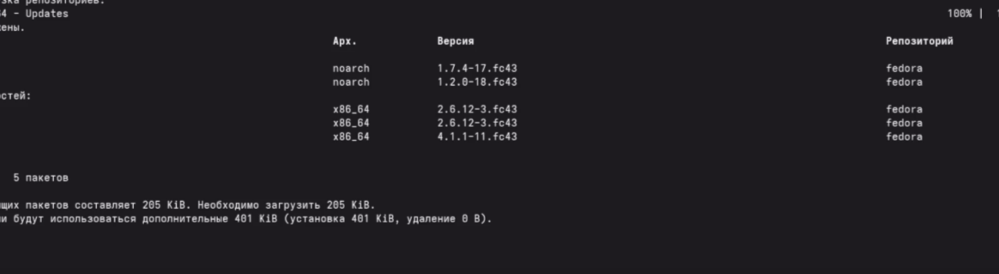
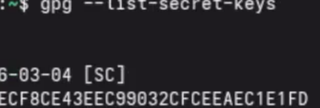
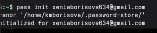
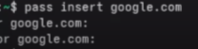
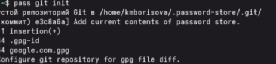

# Настройка рабочей среды

Автор: Борисова Ксения Михайловна Преподаватель: Кулябов Дмитрий Сергеевич профессор \* профессор кафедры теории вероятностей и кибербезопасности \* Российский университет дружбы народов им. П. Лумумбы \* [kulyabov-ds\@rudn.ru](mailto:kulyabov-ds@rudn.ru) \* <https://yamadharma.github.io/ru/>

**Информация о докладчике**

{width="178"} Студент НБИбд-01-25

---

# Цель работы

Настройка рабочей среды

---

# Задание

Установить менеджер паролей pass,установить дополнительное программное обеспечение, установить chezmoi.

---

# Выполнение лабораторной работы

Установка pass

---

Создание gpg-ключа

---

Инициализация хранилища pass

---

Добавление паролей

---

Просмотр и копирование паролей

---

Синхронизация с Git

---

Установка chezmoi

---

Создаю свой репозиторий

---

Переношу все на GitHub

---

Настраиваю машину

---

Установка дополнительного ПО

---

Установка шрифтов

---

# Выводы

В ходе лабораторной работы был изучен менеджер паролей с шифрованием GPG и синхронизацией через Git - **pass** ; система управления конфигурационными файлами с использованием шаблонов и Git-репозитория- **chezmoi**. Созданы репозитории на Github,добавлены пароли и конфигурационные файлы.

---

# Список литературы

ТУИС. Архитектура компьютеров и операционные системы. Раздел "Операционные системы". Лабораторная работа №5.

<https://esystem.rudn.ru/mod/page/view.php?id=1358330>

