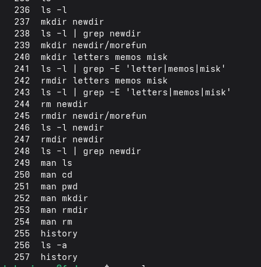

# Основы интерфейса взаимодействия пользователя с системой Unix на уровне командной строки

# Цель работы

Приобретение практических навыков взаимодействия пользователя с системой
по- средством командной строки.

# Задание

1.  Определите полное имя вашего домашнего каталога. Далее относительно
    этого ката- лога будут выполняться последующие упражнения.
2.  Выполните следующие действия: 2.1. Перейдите в каталог /tmp. 2.2.
    Выведите на экран содержимое каталога /tmp. Для этого используйте
    команду ls с различными опциями. Поясните разницу в выводимой на
    экран информации. 2.3. Определите, есть ли в каталоге /var/spool
    подкаталог с именем cron? 2.4. Перейдите в Ваш домашний каталог и
    выведите на экран его содержимое. Опре- делите, кто является
    владельцем файлов и подкаталогов?
3.  Выполните следующие действия: 3.1. В домашнем каталоге создайте
    новый каталог с именем newdir. 3.2. В каталоге \~/newdir создайте
    новый каталог с именем morefun. 3.3. В домашнем каталоге создайте
    одной командой три новых каталога с именами letters, memos, misk.
    Затем удалите эти каталоги одной командой. 3.4. Попробуйте удалить
    ранее созданный каталог \~/newdir командой rm. Проверьте, был ли
    каталог удалён. 3.5. Удалите каталог \~/newdir/morefun из домашнего
    каталога. Проверьте, был ли каталог удалён.
4.  С помощью команды man определите, какую опцию команды ls нужно
    использо- вать для просмотра содержимое не только указанного
    каталога, но и подкаталогов, входящих в него.
5.  С помощью команды man определите набор опций команды ls, позволяющий
    отсорти- ровать по времени последнего изменения выводимый список
    содержимого каталога с развёрнутым описанием файлов.
6.  Используйте команду man для просмотра описания следующих команд: cd,
    pwd, mkdir, rmdir, rm. Поясните основные опции этих команд.
7.  Используя информацию, полученную при помощи команды history,
    выполните мо- дификацию и исполнение нескольких команд из буфера
    команд

# Теоретическое введение

В операционной системе типа Linux взаимодействие пользователя с системой
обычно осуществляется с помощью командной строки посредством построчного
ввода ко- манд. При этом обычно используется командные интерпретаторы
языка shell: /bin/sh; /bin/csh; /bin/ksh. Формат команды. Командой в
операционной системе называется записанный по специальным правилам текст
(возможно с аргументами), представляющий собой ука- зание на выполнение
какой-либо функций (или действий) в операционной системе. Обычно первым
словом идёт имя команды, остальной текст — аргументы или опции,
конкретизирующие действие. Общий формат команд можно представить
следующим образом: <имя_команды><разделитель><аргументы> Команда man.
Команда man используется для просмотра (оперативная помощь) в диа-
логовом режиме руководства (manual) по основным командам операционной
системы типа Linux. Формат команды: man <команда> Пример (вывод
информации о команде man): 1 man man Для управления просмотром
результата выполнения команды man можно использовать следующие клавиши:
– Space — перемещение по документу на одну страницу вперёд; – Enter —
перемещение по документу на одну строку вперёд; – q — выход из режима
просмотра описания. Команда cd. Команда cd используется для перемещения
по файловой системе опера- ционной системы типа Linux. Замечание 1.
Файловая система ОС типа Linux — иерархическая система каталогов,
подкаталогов и файлов, которые обычно организованы и сгруппированы по
функ- циональному признаку. Самый верхний каталог в иерархии называется
корневым и обозначается символом /. Корневой каталог содержит системные
файлы и другие каталоги. Формат команды: cd [путь_к_каталогу] Кулябов Д.
С. и др. Операционные системы 39 Для перехода в домашний каталог
пользователя следует использовать команду cd без параметров или cd \~.
Например, команда 1 cd /afs/dk.sci.pfu.edu.ru/home позволяет перейти в
каталог /afs/dk.sci.pfu.edu.ru/home (если такой существует), а для того,
чтобы подняться выше на одну директорию, следует использовать: 1 cd ..
Подробнее об опциях команды cd смотри в справке с помощью команды man: 1
man cd Команда pwd. Для определения абсолютного пути к текущему каталогу
используется команда pwd (print working directory). Пример (абсолютное
имя текущего каталога пользователя dharma): 1 pwd результат: 1
/afs/dk.sci.pfu.edu.ru/home/d/h/dharma 2 Сокращения имён файлов. В
работе с командами, в качестве аргументов которых выступает путь к
какому-либо каталогу или файлу, можно использовать сокращённую запись
пути. Символы сокращения приведены в табл. 4.1. Таблица 4.1 Символы
сокращения имён файлов Символ Значение \~ Домашний каталог . Текущий
каталог .. Родительский каталог Например, в команде cd для перемещения
по файловой системе сокращённую за- пись пути можно использовать
следующим образом (команды чередуются с выводом результата выполнения
команды pwd): 1 pwd 2 3 /afs/dk.sci.pfu.edu.ru/home/d/h/dharma 4 40
Лабораторная работа № 4. Основы интерфейса взаимодействия пользователя с
системой … 5 cd .. 6 pwd 7 8 /afs/dk.sci.pfu.edu.ru/home/d/h 9 10 cd
../.. 11 pwd 12 13 /afs/dk.sci.pfu.edu.ru/home 14 15 cd \~/work 16 pwd
17 18 /afs/dk.sci.pfu.edu.ru/home/d/h/dharma/work Команда ls. Команда ls
используется для просмотра содержимого каталога. Формат команды: ls
[-опции] [путь] Пример: 1 cd 2 cd .. 3 pwd 4 5
/afs/dk.sci.pfu.edu.ru/home/d/h 6 7 ls 8 9 dharma Некоторые файлы в
операционной системе скрыты от просмотра и обычно исполь- зуются для
настройки рабочей среды. Имена таких файлов начинаются с точки. Для
того, чтобы отобразить имена скрытых файлов, необходимо использовать
команду ls с опцией a: 1 ls -a Можно также получить информацию о типах
файлов (каталог, исполняемый файл, ссылка), для чего используется опция
F. При использовании этой опции в поле имени выводится символ, который
определяет тип файла (см. табл. 4.2) Таблица 4.2 Символ, который
определяет тип файла Тип файла Символ Каталог / Исполняемый файл *Ссылка
\@ Кулябов Д. С. и др. Операционные системы 41 Чтобы вывести на экран
подробную информацию о файлах и каталогах, необходимо использовать опцию
l. При этом о каждом файле и каталоге будет выведена следующая
информация: – тип файла, – право доступа, – число ссылок, – владелец, –
размер, – дата последней ревизии, – имя файла или каталога. Пример: 1 cd
/ 2 ls Результат: 1 bin boot dev etc home lib media mnt 2 opt proc root
sbin sys tmp usr var В этом же каталоге команда 1 ls -alF даст примерно
следующий результат: 1 drwxr-xr-x 21 root root 4096 Jan. 17 09:00 ./ 2
drwxr-xr-x 21 root root 4096 Jan. 17 09:00 ../ 3 drwxr-xr-x 2 root root
4096 Jan. 18 15:57 bin/ 4 drwxr-xr-x 2 root root 4096 Apr. 14 2008 boot/
5 drwxr-xr-x 20 root root 14120 Feb. 17 10:48 dev/ 6 drwxr-xr-x 170 root
root 12288 Feb. 17 09:19 etc/ 7 drwxr-xr-x 6 root root 4096 Aug. 5 2009
home/ 8 lrwxrwxrwx 1 root root 5 Jan. 12 22:01 lib -\> lib64/ 9
drwxr-xr-x 8 root root 4096 Jan. 30 21:41 media/ 10 drwxr-xr-x 5 root
root 4096 Jan. 17 2010 mnt/ 11 drwxr-xr-x 25 root root 4096 Jan. 16
09:55 opt/ 12 dr-xr-xr-x 163 root root 0 Feb. 17 13:17 proc/ 13
drwxr-xr-x 31 root root 4096 Feb. 15 23:57 root/ 14 drwxr-xr-x 2 root
root 12288 Jan. 18 15:57 sbin/ 15 drwxr-xr-x 12 root root 0 Feb. 17
13:17 sys/ 16 drwxrwxrwt 12 root root 500 Feb. 17 16:35 tmp/ 17
drwxr-xr-x 22 root root 4096 Jan. 18 09:26 usr/ 18 drwxr-xr-x 17 root
root 4096 Jan. 14 17:38 var/ Команда mkdir. Команда mkdir используется
для создания каталогов. Формат команды: mkdir имя_каталога1
[имя_каталога2...] Пример создания каталога в текущем каталоге: 42
Лабораторная работа № 4. Основы интерфейса взаимодействия пользователя с
системой … 1 cd 2 pwd 3 4 /afs/dk.sci.pfu.edu.ru/home/d/h/dharma 5 6 ls
7 8 Desktop public tmp 9 GNUstep public_html work 10 11 mkdir abc 12 ls
13 14 abc GNUstep public_html work 15 Desktop public tmp Замечание 2.
Для того чтобы создать каталог в определённом месте файловой системы,
должны быть правильно установлены права доступа. Можно создать также
подкаталог в существующем подкаталоге: 1 mkdir parentdir 2 mkdir
parentdir/dir При задании нескольких аргументов создаётся несколько
каталогов: 1 cd parentdir 2 mkdir dir1 dir2 dir3 Можно использовать
группировку: 1 mkdir parentdir/{dir1,dir2,dir3} Если же требуется
создать подкаталог в каталоге, отличном от текущего, то путь к нему
требуется указать в явном виде: 1 mkdir ../dir1/dir2 или 1 mkdir
\~/dir1/dir2 Интересны следующие опции: --mode (или -m) — установка
атрибутов доступа; --parents (или -p) — создание каталога вместе с
родительскими по отношению к нему каталогами. Атрибуты задаются в
численной или символьной нотации: 1 mkdir --mode=777 dir Кулябов Д. С. и
др. Операционные системы 43 или 1 mkdir -m a+rwx dir Опция --parents
(краткая форма -p) позволяет создавать иерархическую цепочку
подкаталогов, создавая все промежуточные каталоги: 1 mkdir -p
\~/dir1/dir2/dir3 Команда rm. Команда rm используется для удаления
файлов и/или каталогов. Формат команды: rm [-опции] [файл] Если
требуется, чтобы выдавался запрос подтверждения на удаление файла, то
необхо- димо использовать опцию i. Чтобы удалить каталог, содержащий
файлы, нужно использовать опцию r. Без указания этой опции команда не
будет выполняться. Пример: 1 cd 2 mkdir abs 3 rm abc 4 5 rm: abc is a
directory 6 7 rm -r abc Если каталог пуст, то можно воспользоваться
командой rmdir. Если удаляемый каталог содержит файлы, то команда не
будет выполнена — нужно использовать rm - r имя_каталога. Команда
history. Для вывода на экран списка ранее выполненных команд исполь-
зуется команда history. Выводимые на экран команды в списке нумеруются.
К любой команде из выведенного на экран списка можно обратиться по её
номеру в списке, воспользовавшись конструкцией !*<номер_команды>.
Пример: 1 history 2 1 pwd 3 2 ls 4 3 ls -a 5 4 ls -l 6 5 cd / 7 6
history 8 9 !5 10 cd / Можно модифицировать команду из выведенного на
экран списка при помощи следу- ющей конструкции: 44 Лабораторная работа
№ 4. Основы интерфейса взаимодействия пользователя с системой …
!<номер_команды>:s/<что_меняем>/<на_что_меняем> Пример: 1 !3:s/a/F 2 ls
-F Замечание 3. Если в заданном контексте встречаются специальные
символы (типа «.», «/», «» и т.д.), надо перед ними поставить символ
экранирования  (обратный слэш). Использование символа «;». Если
требуется выполнить последовательно несколько команд, записанный в одной
строке, то для этого используется символ точка с запятой Пример: 1 cd;
ls

# Выполнение лабораторной работы

Определяю полное имя своего домашнего каталога.

Перехожу в каталог /tmp.

Вывожу на экран содержимое каталога /tmpс помощью команды ls с
различными опциями.

Вот описание команд и разницы между ними для пункта 2.2, чтобы вы могли вставить это в отчет:

**2.2. Выведите на экран содержимое каталога /tmp. Для этого используйте команду ls с различными опциями. Поясните разницу в выводимой на экран информации.**

Для просмотра содержимого каталога /tmp были использованы следующие команды с различными опциями:

1. **`ls /tmp`** — базовая команда без опций. Выводит только имена файлов и каталогов, расположенных непосредственно в каталоге /tmp. Скрытые файлы (начинающиеся с точки) не отображаются. Информация выводится в несколько колонок для компактности.

2. **`ls -l /tmp`** — опция `-l` (long format) выводит подробную информацию о каждом объекте в виде списка. Для каждого файла или каталога отображается: тип файла (первый символ: `-` для файла, `d` для каталога), права доступа, количество ссылок, владелец, группа-владелец, размер в байтах, дата и время последнего изменения, имя объекта.

3. **`ls -a /tmp`** — опция `-a` (all) показывает все содержимое каталога, включая скрытые файлы (имена которых начинаются с точки), а также служебные записи "." (текущий каталог) и ".." (родительский каталог).

4. **`ls -F /tmp`** — опция `-F` (classify) добавляет к именам файлов символы, указывающие на их тип: `/` для каталогов, `*` для исполняемых файлов, `@` для символических ссылок. Это позволяет визуально быстро определить тип объекта без просмотра дополнительных атрибутов.

5. **`ls -al /tmp`** или **`ls -la /tmp`** — комбинация опций `-a` и `-l`. Выводит подробную информацию (как с опцией `-l`) для всех объектов, включая скрытые файлы (как с опцией `-a`). Это наиболее полный формат просмотра содержимого каталога.

6. **`ls -alF /tmp`** — комбинация опций `-a`, `-l` и `-F`. Объединяет возможности всех трех опций: показывает подробную информацию о всех файлах (включая скрытые) с добавлением символов, обозначающих тип файла.

**Разница в выводимой информации:**
- Простая команда `ls` дает только общее представление о содержимом каталога.
- Опция `-l` добавляет метаданные: права доступа, владельца, размер и дату изменения.
- Опция `-a` расширяет список объектов, показывая то, что обычно скрыто от пользователя (конфигурационные файлы и служебные записи).
- Опция `-F` облегчает визуальное восприятие, добавляя подсказки о типе файла прямо к его имени.
- Комбинированные опции (`-al`, `-alF`) позволяют получить максимально полную картину о содержимом каталога и характеристиках каждого объекта.

Определяю, есть ли в каталоге /var/spool подкаталог с именем cron.

Перехожу в свой домашний каталог и вывожу на экран его содержимое.
Определяю, кто является владельцем файлов и подкаталогов.

домашнем каталоге создаю новый каталог с именем newdir.

В каталоге \~/newdir создаю новый каталог с именем morefun

В домашнем каталоге создаю одной командой три новых каталога с именами
letters, memos, misk.

Удаляю эти каталоги одной командой.

Пробую удалить ранее созданный каталог \~/newdir командой rm. Проверяю,
был ли каталог удалён

Удаляю каталог \~/newdir/morefun из домашнего каталога. Проверяю, был ли
каталог удалён.

Пробую удалить пустой каталог newdir

С помощью команды man определяю, какую опцию команды ls нужно
использо-вать для просмотра содержимое не только указанного каталога, но
и подкаталогов, входящих в него.

С помощью команды man определяю набор опций команды ls, позволяющий
отсорти- ровать по времени последнего изменения выводимый список
содержимого каталога с развёрнутым описанием файлов.

Использую команду man для просмотра описания следующих команд: cd, pwd,
mkdir, rmdir, rm. Поясните основные опции этих команд.

Используя информацию, полученную при помощи команды history, выполняю
мо- дификацию и исполнение нескольких команд из буфера команд.

Меняю команду №236 ls -l на ls -a

# Ответы на вопросы

Вот ответы на контрольные вопросы по лабораторной работе №4, представленные сплошным текстом для копирования:

1. Командная строка — это интерфейс взаимодействия между пользователем и операционной системой, при котором команды вводятся вручную в виде текстовых строк с клавиатуры. В Linux взаимодействие обычно осуществляется с помощью командных интерпретаторов (shell), таких как /bin/sh, /bin/bash, /bin/csh, которые обрабатывают введенный текст и выполняют указанные действия.

2. Для определения абсолютного пути к текущему каталогу используется команда pwd (print working directory). Пример: pwd. Возможный результат: /home/имя_пользователя.

3. Для просмотра только типов файлов и их имен используется команда ls с опцией -F. Эта опция добавляет к имени файла символ, указывающий на его тип: / для каталогов, * для исполняемых файлов, @ для ссылок. Пример: ls -F. Возможный результат: Desktop/ GNUstep/ public_html/ work/ script.sh* document.txt.

4. Чтобы отобразить скрытые файлы (имена которых начинаются с точки), нужно использовать команду ls с опцией -a (all). Пример: ls -a. Возможный результат: . .. .bashrc .profile Desktop public_html.

5. Файл можно удалить командой rm. Пример: rm файл.txt. Пустой каталог можно удалить командой rmdir. Пример: rmdir пустой_каталог. Непустой каталог можно удалить командой rm -r (рекурсивно). Пример: rm -r каталог_с_файлами. Да, можно удалить и файл, и каталог одной и той же командой rm, но с разными опциями. Для файла опции не нужны (или нужна -i для подтверждения), а для каталога обязательно нужна опция -r.

6. Для вывода списка ранее выполненных команд используется команда history.

7. Можно обратиться к команде по её номеру из списка history и выполнить её с помощью конструкции !<номер_команды>. Для модификации команды перед выполнением используется конструкция !<номер_команды>:s/<что_меняем>/<на_что_меняем>. Пример: Допустим, history показывает: 3 ls -a. Тогда команда !3:s/a/F выполнит ls -F (заменив a на F).

8. Для последовательного выполнения нескольких команд в одной строке используется символ точка с запятой (;). Пример: cd; ls -l. Сначала выполнится cd (переход в домашний каталог), а затем ls -l (вывод подробного списка файлов).

9. Экранирование — это способ использования специальных символов (например, ., /, *, $) как обычных символов, чтобы командная оболочка не интерпретировала их специальным образом. Для экранирования используется обратный слэш \. Пример: Если нам нужно заменить точку в тексте с помощью команды history, но сама точка является служебным символом, мы пишем \.: !3:s/\./F.

10. Опция -l (long) выводит подробную информацию о каждом файле и каталоге. Для каждого объекта выводится следующее (слева направо): тип файла (первый символ: - — файл, d — каталог, l — ссылка); права доступа (следующие 9 символов: rwx для владельца, группы и остальных); число ссылок; владелец; размер (в байтах); дата и время последней ревизии (или создания); имя файла или каталога. Пример: drwxr-xr-x 21 root root 4096 Jan. 17 09:00 ./

11. Абсолютный путь — это полный путь к файлу или каталогу от корневой директории (/). Он всегда начинается с /. Пример: ls /home/user/Documents/file.txt. Относительный путь — это путь к файлу или каталогу относительно текущего рабочего каталога. Он не начинается с /. Для обозначения текущего каталога используется символ ., для родительского — .. Пример: Если текущий каталог — /home/user, то относительный путь к file.txt будет Documents/file.txt. Для перехода в родительский каталог используется cd ..

12. Для получения справочной информации (руководства) по команде используется команда man (от manual). Пример: man ls.

13. Для автоматического дополнения вводимых команд, имен файлов и каталогов служит клавиша Tab.

# Выводы

Вот краткий вывод для лабораторной работы, который можно вставить в отчет:

**Вывод**

В ходе выполнения лабораторной работы были изучены основные принципы взаимодействия с операционной системой Linux посредством командной строки. Освоены базовые команды для навигации по файловой системе (cd, pwd), просмотра содержимого каталогов (ls с различными опциями -a, -l, -F), создания и удаления каталогов (mkdir, rmdir, rm -r). Также были рассмотрены возможности получения справочной информации с помощью команды man, работа с историей команд (history) и приемы модификации команд из буфера истории. Полученные навыки позволяют эффективно управлять файловой системой и выполнять основные операции в терминале Linux без использования графического интерфейса.

# Список литературы

ТУИС. Архитектура компьютеров и операционные системы. Раздел
"Операционные системы". Лабораторная работа №6.

file:///home/kmborisova/%D0%97%D0%B0%D0%B3%D1%80%D1%83%D0%B7%D0%BA%D0%B8/004-lab_shell-2.pdf