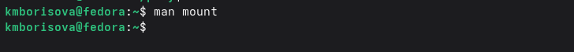

# 
Автор: Борисова Ксения Михайловна Преподаватель: Кулябов Дмитрий Сергеевич профессор \* профессор кафедры теории вероятностей и кибербезопасности \* Российский университет дружбы народов им. П. Лумумбы \* [kulyabov-ds\@rudn.ru](mailto:kulyabov-ds@rudn.ru) \* <https://yamadharma.github.io/ru/>

**Информация о докладчике**

{width="178"} Студент НБИбд-01-25

------------------------------------------------------------------------

# Цель работы

Ознакомление с файловой системой Linux, её структурой, именами и содержанием каталогов. Приобретение практических навыков по применению команд для работы с файлами и каталогами, по управлению процессами (и работами), по проверке исполь- зования диска и обслуживанию файловой системы.


------------------------------------------------------------------------

# Задание

1.  Выполните все примеры, приведённые в первой части описания лабораторной работы.
2.  Выполните следующие действия, зафиксировав в отчёте по лабораторной работе используемые при этом команды и результаты их выполнения: 2.1. Скопируйте файл /usr/include/sys/io.h в домашний каталог и назовите его equipment. Если файла io.h нет, то используйте любой другой файл в каталоге /usr/include/sys/ вместо него. 2.2. В домашнем каталоге создайте директорию \~/ski.plases. 2.3. Переместите файл equipment в каталог \~/ski.plases. 2.4. Переименуйте файл \~/ski.plases/equipment в \~/ski.plases/equiplist. 2.5. Создайте в домашнем каталоге файл abc1 и скопируйте его в каталог \~/ski.plases, назовите его equiplist2. 2.6. Создайте каталог с именем equipment в каталоге \~/ski.plases. 2.7. Переместите файлы \~/ski.plases/equiplist и equiplist2 в каталог \~/ski.plases/equipment. 2.8. Создайте и переместите каталог \~/newdir в каталог \~/ski.plases и назовите его plans.
3.  Определите опции команды chmod, необходимые для того, чтобы присвоить перечис- ленным ниже файлам выделенные права доступа, считая, что в начале таких прав нет: 3.1. drwxr--r-- ... australia 3.2. drwx--x--x ... play 3.3. -r-xr--r-- ... my_os 3.4. -rw-rw-r-- ... feathers При необходимости создайте нужные файлы.
4.  Проделайте приведённые ниже упражнения, записывая в отчёт по лабораторной работе используемые при этом команды: 4.1. Просмотрите содержимое файла /etc/password. 4.2. Скопируйте файл \~/feathers в файл \~/file.old. 4.3. Переместите файл \~/file.old в каталог \~/play. 4.4. Скопируйте каталог \~/play в каталог \~/fun. 4.5. Переместите каталог \~/fun в каталог \~/play и назовите его games. 4.6. Лишите владельца файла \~/feathers права на чтение. 4.7. Что произойдёт, если вы попытаетесь просмотреть файл \~/feathers командой cat? 4.8. Что произойдёт, если вы попытаетесь скопировать файл \~/feathers? 4.9. Дайте владельцу файла \~/feathers право на чтение. 4.10. Лишите владельца каталога \~/play права на выполнение. 4.11. Перейдите в каталог \~/play. Что произошло? 4.12. Дайте владельцу каталога \~/play право на выполнение.
5.  Прочитайте man по командам mount, fsck, mkfs, kill и кратко их охарактеризуйте, приведя примеры

------------------------------------------------------------------------

# Выполнение лабораторной работы

Создаю текстовый файл


---

Копирую файл из системной папки к себе


---

Создаю новую директорию


---

Перемещаю файл в только что созданную директорию


---

Переименовываю файл


---

Копирую файл и меняю название


---

Создаю папку eguipment внутри папки ski.plases


---

Перемещаю файла equiplist и equiplist 2 в ski.plases/equipment


---

Создаю новую директорию


---

Перемещаю директорию в ski.plases и переименовываю ее в plans


---

Создаю папку australia и проверяю ее права по умолчанию


---

Устанавливаю права


---

Создаю папки и устанавливаю нужные права по заданию


---

Смотрю файл passwd


---

Копирую файл feathers в file.old


---

Перемещаю file.old в play


---

Рекурсивно копирую play в fun


---

Перемещаю папку fun в play и переименовываю ее


---

Лишаю feathers прав на чтение


---

Пытаюсь просмотреть feathers


---

Пытаюсь скопировать feathers в другой файл


---

Возвращаю feathers права на чтение


---

Лишаю play права на выполнение


---

Возвращаю play право на выполнение


---

Открываю руководста по командам



--

**Команда mount**

Назначение:
Команда mount используется для монтирования файловых систем. Она присоединяет файловую систему, находящуюся на каком-либо устройстве (например, жёстком диске, USB-накопителе), к определённому каталогу (точке монтирования) в иерархии файловой системы. После этого содержимое устройства становится доступным для просмотра и работы.

Пример использования:
mount /dev/sdb1 /mnt/usb

Данная команда монтирует устройство /dev/sdb1 (например, USB-флешку) в каталог /mnt/usb. После этого файлы на флешке будут доступны по пути /mnt/usb.

---

**Команда fsck**

Назначение:
Команда fsck (file system check) предназначена для проверки и восстановления целостности файловой системы. Она анализирует файловую систему на наличие ошибок и при возможности исправляет их. Обычно используется при сбоях в работе системы или неправильном отключении накопителя.

Пример использования:
fsck /dev/sda1

Данная команда проверяет файловую систему на устройстве /dev/sda1. Если будут найдены ошибки, утилита предложит их исправить (в зависимости от указанных опций).

---

**Команда mkfs**

Назначение:
Команда mkfs (make file system) используется для создания файловой системы на устройстве (например, на жёстком диске или разделе). Перед использованием нового накопителя его необходимо отформатировать с помощью этой команды. Существуют её разновидности для разных типов файловых систем, например mkfs.ext4, mkfs.ntfs.

Пример использования:
mkfs.ext4 /dev/sdb1

Данная команда создаёт файловую систему типа ext4 на устройстве /dev/sdb1. Все данные, которые были на этом разделе, будут удалены.

---

**Команда kill**

Назначение:
Команда kill используется для отправки сигналов процессам. Чаще всего применяется для завершения (остановки) процессов. Каждому процессу присвоен уникальный идентификатор (PID). С помощью kill можно отправить процессу сигнал, например, сигнал SIGTERM (мягкое завершение) или SIGKILL (принудительное завершение).

Пример использования:
kill -9 1234

Данная команда отправляет процессу с идентификатором PID 1234 сигнал SIGKILL (опция -9), что приводит к принудительному и немедленному завершению этого процесса.

# Ответы на вопросы

### 1. Дайте характеристику каждой файловой системе, существующей на жёстком диске компьютера, на котором вы выполняли лабораторную работу.

На компьютере, где выполнялась лабораторная работа, установлена операционная система Fedora. В Fedora по умолчанию используется файловая система **Btrfs** (начиная с версии Fedora 33) .

**Характеристика Btrfs:**
- Поддерживает создание "снимков" (snapshots) и клонов файловой системы, что удобно для резервного копирования
- Обеспечивает проверку целостности данных и автоматическое исправление ошибок
- Поддерживает динамическое расширение и сжатие данных
- Позволяет объединять несколько физических устройств в одну файловую систему
- Имеет встроенные средства для балансировки данных между устройствами 

Также в системе могут присутствовать другие типы файловых систем:
- **proc** — виртуальная файловая система, монтируемая в `/proc`, предоставляет информацию о процессах и состоянии системы
- **sysfs** — виртуальная ФС в `/sys`, содержит информацию об устройствах и драйверах
- **tmpfs** — временная ФС, работающая в оперативной памяти (используется в `/dev`, `/run`, `/tmp`)
- **devpts** — виртуальная ФС для псевдотерминалов в `/dev/pts` 

---

### 2. Приведите общую структуру файловой системы и дайте характеристику каждой директории первого уровня этой структуры.

В Linux используется иерархическая структура файловой системы с корнем в каталоге `/`. Все каталоги и файлы находятся внутри этого корневого каталога. Структура соответствует стандарту FHS (Filesystem Hierarchy Standard) .

**Основные каталоги первого уровня и их назначение:**

| Каталог | Назначение |
|---------|------------|
| `/bin` | Содержит основные пользовательские команды, необходимые для работы системы в однопользовательском режиме (например, `ls`, `cp`, `sh`)  |
| `/boot` | Содержит файлы, необходимые для загрузки системы: ядро Linux (vmlinuz), образ initrd, загрузчик GRUB  |
| `/dev` | Содержит файлы устройств, через которые система обращается к аппаратному обеспечению (диски, терминалы и т.д.)  |
| `/etc` | Хранит конфигурационные файлы системы и установленных программ  |
| `/home` | Содержит домашние каталоги обычных пользователей (для пользователя `kmborisova` это `/home/kmborisova`)  |
| `/lib` | Содержит разделяемые библиотеки, необходимые для работы программ из `/bin` и `/sbin`, а также модули ядра  |
| `/media` | Точка монтирования для сменных носителей (CD, USB-флешек)  |
| `/mnt` | Временная точка монтирования для файловых систем, монтируемых вручную  |
| `/opt` | Для установки дополнительного программного обеспечения (адд-онов)  |
| `/proc` | Виртуальная файловая система, предоставляющая информацию о процессах и состоянии ядра  |
| `/root` | Домашний каталог суперпользователя root  |
| `/run` | Хранит временные данные времени выполнения (PID-файлы, сокеты), очищается при перезагрузке  |
| `/sbin` | Содержит системные команды для администрирования (например, `fsck`, `mount`, `shutdown`)  |
| `/srv` | Для данных, обслуживаемых системой (web-серверы, FTP)  |
| `/sys` | Виртуальная ФС, предоставляющая информацию об устройствах и драйверах ядра  |
| `/tmp` | Временные файлы (обычно очищаются при перезагрузке)  |
| `/usr` | Вторичная иерархия для прикладных программ и данных пользователя (только для чтения)  |
| `/var` | Хранит изменяемые данные: логи, почту, спулы принтера, кэш  |

---

### 3. Какая операция должна быть выполнена, чтобы содержимое некоторой файловой системы было доступно операционной системе?

Чтобы содержимое файловой системы стало доступно операционной системе, необходимо выполнить операцию **монтирования (mount)** .

Монтирование — это процесс присоединения файловой системы, расположенной на каком-либо устройстве (жёстком диске, разделе, USB-накопителе), к определённому каталогу в иерархии файловой системы. Этот каталог называется **точкой монтирования** .

**Пример команды монтирования:**
```bash
mount /dev/sdb1 /mnt/usb
```

После выполнения этой команды содержимое устройства `/dev/sdb1` становится доступным по пути `/mnt/usb`. Для отключения файловой системы используется команда `umount` .

**Важные замечания:**
- Точка монтирования должна быть существующим пустым каталогом
- Обычно монтирование требует прав суперпользователя (root)
- Информация о монтируемых по умолчанию файловых системах хранится в файле `/etc/fstab` 

---

### 4. Назовите основные причины нарушения целостности файловой системы. Как устранить повреждения файловой системы?

**Основные причины нарушения целостности файловой системы:**

1. **Некорректное завершение работы системы** — внезапное отключение электропитания, сбой питания, "жёсткая" перезагрузка без корректного размонтирования разделов
2. **Аппаратные сбои** — появление坏 секторов (bad blocks) на жёстком диске, нестабильная работа контроллера диска
3. **Ошибки программного обеспечения** — сбои драйверов, ошибки в работе программ, работающих напрямую с диском
4. **Человеческий фактор** — случайное удаление важных системных файлов 

**Устранение повреждений:**

Для проверки и восстановления целостности файловой системы используется команда **`fsck`** (file system consistency check) .

**Важное правило:** `fsck` **нельзя запускать на смонтированной** файловой системе, так как это может привести к дополнительным повреждениям. Перед проверкой файловую систему необходимо размонтировать .

**Примеры использования:**
```bash
# Проверка и автоматическое исправление ошибок
sudo fsck -a /dev/sda1

# Проверка с подтверждением каждого исправления
sudo fsck -y /dev/sda1
```

**Особенности проверки корневого раздела (/)**: так как его нельзя размонтировать в работающей системе, проверку выполняют либо в режиме восстановления (recovery mode), либо с помощью создания файла `forcefsck` с последующей перезагрузкой:
```bash
sudo touch /forcefsck
sudo reboot
```

---

### 5. Как создаётся файловая система?

Для создания файловой системы на устройстве (диске, разделе) используется команда **`mkfs`** (make filesystem) .

`mkfs` является фронтендом (оболочкой) для утилит, специфичных для каждого типа файловой системы: `mkfs.ext4`, `mkfs.btrfs`, `mkfs.xfs`, `mkfs.vfat` и других .

**Формат команды:**
```bash
mkfs [-t тип] устройство
```

**Примеры создания файловой системы:**
```bash
# Создание файловой системы ext4 на разделе /dev/sdb1
mkfs -t ext4 /dev/sdb1

# То же самое с помощью специфичной команды
mkfs.ext4 /dev/sdb1

# Создание файловой системы Btrfs
mkfs.btrfs /dev/sdc1
```

**Важные замечания:**
- Создание файловой системы **уничтожает все данные**, находившиеся на устройстве
- Команда требует прав суперпользователя (root)
- Тип файловой системы можно не указывать, если используется специфичная команда (`mkfs.ext4`)
- После создания ФС устройство необходимо смонтировать, чтобы начать им пользоваться 

---

### 6. Дайте характеристику командам для просмотра текстовых файлов.

В Linux существует несколько команд для просмотра содержимого текстовых файлов, каждая из которых имеет свои особенности :

| Команда | Описание | Пример использования |
|---------|----------|---------------------|
| `cat` | Выводит содержимое файла целиком на экран. Подходит для небольших файлов. | `cat file.txt` |
| `tac` | Работает как `cat`, но выводит строки в обратном порядке (с конца) | `tac file.txt` |
| `nl` | Выводит содержимое файла с нумерацией строк | `nl file.txt` |
| `more` | Постраничный просмотр. Пробел — следующая страница, Enter — следующая строка, q — выход | `more file.txt` |
| `less` | Более совершенный постраничный просмотр, позволяет прокручивать как вперёд, так и назад. Поддерживает поиск | `less file.txt` |
| `head` | Выводит первые строки файла (по умолчанию 10) | `head -n 20 file.txt` |
| `tail` | Выводит последние строки файла (по умолчанию 10). Полезен для просмотра логов | `tail -f /var/log/syslog` |

**Клавиши управления в less/more:**
- **Space** — следующая страница
- **Enter** — следующая строка
- **b** — предыдущая страница (в less)
- **/слово** — поиск по файлу
- **q** — выход 

---

### 7. Приведите основные возможности команды cp в Linux.

Команда `cp` (copy) используется для копирования файлов и каталогов .

**Формат команды:**
```bash
cp [опции] источник назначение
cp [опции] источник... каталог
```

**Основные возможности и опции:**

| Опция | Описание | Пример |
|-------|----------|--------|
| `-i` | Запрашивает подтверждение перед перезаписью существующего файла | `cp -i file1.txt file2.txt` |
| `-r`, `-R` | Рекурсивное копирование каталогов (копирует всё содержимое) | `cp -r dir1/ dir2/` |
| `-v` | Подробный вывод (показывает, что копируется) | `cp -v file.txt /tmp/` |
| `-u` | Копирует только если исходный файл новее целевого | `cp -u source.txt dest.txt` |
| `-a` | Архивное копирование (сохраняет права, владельца, временные метки) | `cp -a /home/user /backup/` |
| `-p` | Сохраняет атрибуты файла (права, время) | `cp -p file.txt copy.txt` |
| `-l` | Создаёт жёсткие ссылки вместо копирования | `cp -l file.txt hardlink.txt` |
| `-s` | Создаёт символические ссылки | `cp -s file.txt symlink.txt` |

**Примеры использования:**
```bash
# Копирование файла в текущем каталоге
cp file1.txt file2.txt

# Копирование нескольких файлов в каталог
cp file1.txt file2.txt ~/backup/

# Рекурсивное копирование каталога
cp -r /home/user/documents/ /media/backup/
```

---

### 8. Приведите основные возможности команды mv в Linux.

Команда `mv` (move) используется для перемещения и переименования файлов и каталогов .

**Формат команды:**
```bash
mv [опции] источник назначение
mv [опции] источник... каталог
```

**Основные возможности и опции:**

| Опция | Описание | Пример |
|-------|----------|--------|
| `-i` | Запрашивает подтверждение перед перезаписью существующего файла | `mv -i file.txt /target/` |
| `-u` | Перемещает только если исходный файл новее целевого | `mv -u old.txt new.txt` |
| `-v` | Подробный вывод (показывает, что перемещается) | `mv -v file.txt /tmp/` |
| `-n` | Не перезаписывать существующие файлы | `mv -n source.txt dest.txt` |

**Примеры использования:**
```bash
# Переименование файла
mv oldname.txt newname.txt

# Перемещение файла в другой каталог
mv file.txt ~/documents/

# Перемещение нескольких файлов в каталог
mv file1.txt file2.txt ~/backup/

# Переименование каталога
mv old_dir new_dir

# Перемещение каталога внутрь другого каталога
mv my_folder /home/user/documents/
```

**Важно:** При перемещении файла в пределах одного раздела диска `mv` просто изменяет путь к файлу в файловой системе, не перемещая физически данные. При перемещении между разными устройствами происходит копирование с последующим удалением оригинала .

---

### 9. Что такое права доступа? Как они могут быть изменены?

**Права доступа** — это механизм, определяющий, какие действия (чтение, запись, выполнение) разрешены для различных категорий пользователей при работе с файлами и каталогами .

В Linux права доступа разделяются на три категории пользователей:
- **u (user)** — владелец файла
- **g (group)** — группа, к которой принадлежит владелец
- **o (others)** — все остальные пользователи

Для каждого объекта (файла или каталога) определяются три типа прав:
- **r (read)** — чтение
- **w (write)** — запись
- **x (execute)** — выполнение (для файлов) / доступ в каталог (для каталогов) 

**Просмотр прав доступа:**
```bash
ls -l имя_файла
```
Вывод будет выглядеть, например, так: `-rw-r--r--`, где:
- первый символ `-` — тип (файл), `d` — каталог
- следующие три символа `rw-` — права владельца
- затем три `r--` — права группы
- последние три `r--` — права остальных

**Изменение прав доступа** выполняется командой **`chmod`** (change mode) .

**Символьный способ:**
```bash
chmod [категория][оператор][право] файл
```
- Категория: `u`, `g`, `o`, `a` (all — все)
- Оператор: `+` (добавить), `-` (убрать), `=` (установить точно)
- Право: `r`, `w`, `x`

**Примеры:**
```bash
# Добавить владельцу право на выполнение
chmod u+x script.sh

# Убрать у группы право на запись
chmod g-w file.txt

# Установить для всех право только на чтение
chmod a=r file.txt
```

**Числовой (восьмеричный) способ:**
Каждое право имеет числовое значение: `r=4`, `w=2`, `x=1`. Права задаются трёхзначным числом (владелец/группа/остальные) .

**Примеры:**
```bash
# 755 = rwxr-xr-x (владелец: всё, группа: чтение+выполнение, остальные: чтение+выполнение)
chmod 755 script.sh

# 644 = rw-r--r-- (владелец: чтение+запись, группа: чтение, остальные: чтение)
chmod 644 file.txt

# 700 = rwx------ (только владелец имеет полный доступ)
chmod 700 private_dir
```

# Выводы

В ходе выполнения лабораторной работы были изучены основные команды для работы с файлами и каталогами в операционной системе Linux (Fedora).

**Были освоены следующие навыки:**

1. **Работа с файлами и каталогами:**
   - Создание, копирование, перемещение и переименование файлов и каталогов с помощью команд `touch`, `cp`, `mv`
   - Просмотр содержимого файлов командами `cat`, `less`, `head`, `tail`

2. **Управление правами доступа:**
   - Изучена структура прав доступа (чтение, запись, выполнение) для владельца, группы и остальных пользователей
   - Изменение прав доступа с помощью команды `chmod` в символьном и числовом форматах
   - Экспериментально подтверждено, что отсутствие права на чтение (`r`) не позволяет просмотреть содержимое файла, а отсутствие права на выполнение (`x`) для каталога делает невозможным вход в него

3. **Файловая система:**
   - Изучена структура файловой системы Linux, назначение основных каталогов первого уровня
   - Рассмотрены команды для работы с файловыми системами: `mount` (монтирование), `fsck` (проверка целостности), `mkfs` (создание файловой системы), `kill` (управление процессами)

4. **Практическое применение:**
   - Все примеры, приведённые в методических указаниях, были выполнены
   - Получены навыки работы с командами в терминале, устранения ошибок доступа

Таким образом, цели лабораторной работы достигнуты: приобретены практические навыки работы с файловой системой Linux, управления файлами, каталогами и правами доступа.

# Список литературы

ТУИС. Архитектура компьютеров и операционные системы. Раздел "Операционные системы". Лабораторная работа №7.

https://esystem.rudn.ru/pluginfile.php/3097171/mod_resource/content/4/005-lab_files.pdf