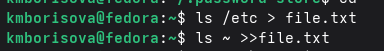
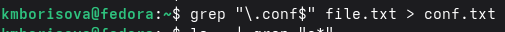
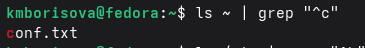
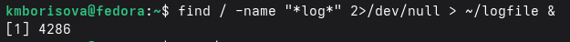
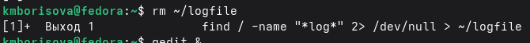
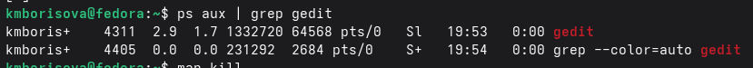
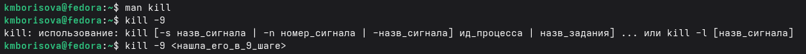
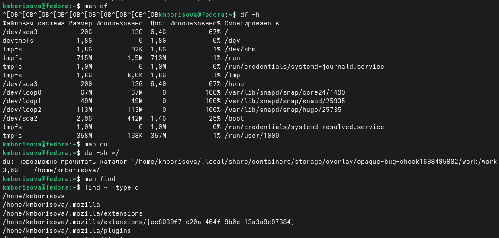

# Поиск файлов. Перенаправление ввода-вывода. Просмотр запущенных процессов

# Цель работы

Ознакомление с инструментами поиска файлов и фильтрации текстовых
данных. Приобретение практических навыков: по управлению процессами (и
заданиями), по проверке использования диска и обслуживанию файловых
систем.

# Задание

1.  Осуществите вход в систему, используя соответствующее имя
    пользователя.
2.  Запишите в файл file.txt названия файлов, содержащихся в каталоге
    /etc. Допи- шите в этот же файл названия файлов, содержащихся в
    вашем домашнем каталоге.
3.  Выведите имена всех файлов из file.txt, имеющих расширение .conf,
    после чего запишите их в новый текстовой файл conf.txt.
4.  Определите, какие файлы в вашем домашнем каталоге имеют имена,
    начинавшиеся с символа c? Предложите несколько вариантов, как это
    сделать.
5.  Выведите на экран (по странично) имена файлов из каталога /etc,
    начинающиеся с символа h.
6.  Запустите в фоновом режиме процесс, который будет записывать в файл
    \~/logfile файлы, имена которых начинаются с log.
7.  Удалите файл \~/logfile.
8.  Запустите из консоли в фоновом режиме редактор gedit.
9.  Определите идентификатор процесса gedit, используя команду ps,
    конвейер и фильтр grep. Как ещё можно определить идентификатор
    процесса?
10. Прочтите справку (man) команды kill, после чего используйте её для
    завершения процесса gedit.
11. Выполните команды df и du, предварительно получив более подробную
    информацию об этих командах, с помощью команды man.
12. Воспользовавшись справкой команды find, выведите имена всех
    директорий, имею- щихся в вашем домашнем каталоге.

# Теоретическое введение

6.2.1. Перенаправление ввода-вывода В системе по умолчанию открыто три
специальных потока: – stdin — стандартный поток ввода (по умолчанию:
клавиатура), файловый дескриптор 0; – stdout — стандартный поток вывода
(по умолчанию: консоль), файловый дескриптор 1; – stderr — стандартный
поток вывод сообщений об ошибках (по умолчанию: консоль), файловый
дескриптор 2. Большинство используемых в консоли команд и программ
записывают результаты своей работы в стандартный поток вывода stdout.
Например, команда ls выводит в стан- дартный поток вывода (консоль)
список файлов в текущей директории. Потоки вывода и ввода можно
перенаправлять на другие файлы или устройства. Проще всего это делается
с помощью символов \>, \>\>, \<, \<\<. Рассмотрим пример. 1 \#
Перенаправление stdout (вывода) в файл. 2 \# Если файл отсутствовал, то
он создаётся, 3 \# иначе -- перезаписывается. 4 5 \# Создаёт файл,
содержащий список дерева каталогов. 6 ls -lR \> dir-tree.list 7 8
1\>filename 9 \# Перенаправление вывода (stdout) в файл "filename". 10
1\>\>filename 11 \# Перенаправление вывода (stdout) в файл "filename",
12 \# файл открывается в режиме добавления. 13 2\>filename 14 \#
Перенаправление stderr в файл "filename". 15 2\>\>filename 16 \#
Перенаправление stderr в файл "filename", 17 \# файл открывается в
режиме добавления. 18 &\>filename 19 \# Перенаправление stdout и stderr
в файл "filename". 56 Лабораторная работа № 6. Поиск файлов.
Перенаправление ввода-вывода. Просмотр … 6.2.2. Конвейер Конвейер (pipe)
служит для объединения простых команд или утилит в цепочки, в ко- торых
результат работы предыдущей команды передаётся последующей. Синтаксис
следующий: 1 команда 1 \| команда 2 2 \# означает, что вывод команды 1
передастся на ввод команде 2 Конвейеры можно группировать в цепочки и
выводить с помощью перенаправления в файл, например: 1 ls -la \|sort \>
sortilg_list вывод команды ls -la передаётся команде сортировки
sort\\verb, которая пишет ре- зультат в файл sorting_list\\verb. Чаще
всего скрипты на Bash используются в качестве автоматизации каких-то
рутин- ных операций в консоли, отсюда иногда возникает необходимость в
обработке stdout одной команды и передача на stdin другой команде, при
этом результат выполнения команды должен обработан. 6.2.3. Поиск файла
Команда find используется для поиска и отображения на экран имён файлов,
соответ- ствующих заданной строке символов. Формат команды: 1 find путь
[-опции] Путь определяет каталог, начиная с которого по всем
подкаталогам будет вестись поиск. Примеры: 1. Вывести на экран имена
файлов из вашего домашнего каталога и его подкаталогов, начинающихся на
f: 1 find \~ -name "f*" -print Здесь \~ — обозначение вашего домашнего
каталога, -name — после этой опции указы- вается имя файла, который
нужно найти, "f*" — строка символов, определяющая имя файла, -print —
опция, задающая вывод результатов поиска на экран. 2. Вывести на экран
имена файлов в каталоге /etc, начинающихся с символа p: 1 find /etc
-name "p*" -print 3. Найти в Вашем домашнем каталоге файлы, имена
которых заканчиваются символом \~ и удалить их: 1 find \~ -name "*\~"
-exec rm "{}" ; Здесь опция -exec rm "{}" ; задаёт применение команды rm
ко всем файлам, име- на которых соответствуют указанной после опции
-name строке символов. Для просмотра опций команды find воспользуйтесь
командой man. Кулябов Д. С. и др. Операционные системы 57 6.2.4.
Фильтрация текста Найти в текстовом файле указанную строку символов
позволяет команда grep. Формат команды: 1 grep строка имя_файла Кроме
того, команда grep способна обрабатывать стандартный вывод других команд
(любой текст). Для этого следует использовать конвейер, связав вывод
команды с вводом grep. Примеры: 1. Показать строки во всех файлах в
вашем домашнем каталоге с именами, начинающи- мися на f, в которых есть
слово begin: 1 grep begin f *2. Найти в текущем каталоге все файлы,
содержащих в имени «лаб»: 1 ls -l \| grep лаб 6.2.5. Проверка
использования диска Команда df показывает размер каждого смонтированного
раздела диска. Формат команды: 1 df [-опции] [файловая_система] Пример:
1 df -vi Команда du показывает число килобайт, используемое каждым
файлом или каталогом. Формат команды: 1 du [-опции] [имя_файла...]
Пример. 1 du -a \~/ На afs можно посмотреть использованное пространство
командой 1 fs quota 58 Лабораторная работа № 6. Поиск файлов.
Перенаправление ввода-вывода. Просмотр … 6.2.6. Управление задачами
Любую выполняющуюся в консоли команду или внешнюю программу можно
запустить в фоновом режиме. Для этого следует в конце имени команды
указать знак амперсанда &. Например: 1 gedit & Будет запущен текстовой
редактор gedit в фоновом режиме. Консоль при этом не будет
заблокирована. Запущенные фоном программы называются задачами (jobs).
Ими можно управлять с помощью команды jobs, которая выводит список
запущенных в данный момент задач. Для завершения задачи необходимо
выполнить команду 1 kill %номер задачи 6.2.7. Управление процессами
Любой команде, выполняемой в системе, присваивается идентификатор
процесса (process ID). Получить информацию о процессе и управлять им,
пользуясь идентифи- катором процесса, можно из любого окна командного
интерпретатора. 6.2.8. Получение информации о процессах Команда ps
используется для получения информации о процессах. Формат команды: 1 ps
[-опции] Для получения информации о процессах, управляемых вами и
запущенных (работаю- щих или остановленных) на вашем терминале,
используйте опцию aux. Пример: 1 ps aux Для запуска команды в фоновом
режиме необходимо в конце командной строки ука- зать знак & (амперсанд).
Пример работы, требующей много машинного времени для выполнения, и
которую целесообразно запустить в фоновом режиме: 1 find /var/log -name
"*.log" -print \> l.log &

# Выполнение лабораторной работы

Создаю и наполняю файлы



Фильтрую .conf в новый файл



нахожу файлы в домашнем каталоге,начинающиеся на "c"



Постраничный вывод файлов из /etc на "h"


запускаю фоновый процесс ,который пишет в Ё/logfile файлы с "log" в
имени



Удаляю logfile



Запускаю gedit в фоне


Нахожу PID процесса gedit



убиваю процесс gedit



Выполняю df и du, нахожу все директории в домашнем каталоге



# Ответы на вопросы

**1. Какие потоки ввода вывода вы знаете?**

- `stdin` (0) — стандартный ввод (клавиатура)
- `stdout` (1) — стандартный вывод (экран)
- `stderr` (2) — стандартный вывод ошибок (экран)

---

**2. Объясните разницу между операцией > и >>.**

- `>` — перенаправляет вывод в файл, **перезаписывая** его (старое содержимое удаляется)
- `>>` — перенаправляет вывод в файл, **добавляя** в конец (старое содержимое сохраняется)

---

**3. Что такое конвейер?**

Конвейер (`|`) — это способ передать вывод одной команды на ввод другой команде. Пример: `ls | grep txt`

---

**4. Что такое процесс? Чем это понятие отличается от программы?**

- **Программа** — статичный набор инструкций, хранящийся на диске
- **Процесс** — запущенный экземпляр программы, который выполняется в памяти и имеет своё состояние (PID, контекст, открытые файлы)

---

**5. Что такое PID и GID?**

- **PID** (Process ID) — уникальный идентификатор процесса
- **GID** (Group ID) — идентификатор группы процесса (не путать с GUID пользователя). Обычно равен PID лидера группы процессов.

---

**6. Что такое задачи и какая команда позволяет ими управлять?**

**Задачи (jobs)** — процессы, запущенные из текущей сессии оболочки. Управляет ими команда `jobs`. Также используются `fg` (вывести на передний план), `bg` (запустить в фоне), `kill` (завершить).

---

**7. Найдите информацию об утилитах top и htop. Каковы их функции?**

- **top** — показывает работающие процессы в реальном времени, загрузку CPU, память. Встроена почти во все Linux.
- **htop** — улучшенная версия top с цветами, прокруткой, управлением мышью и более удобным интерфейсом.

---

**8. Назовите и дайте характеристику команде поиска файлов. Приведите примеры использования этой команды.**

Команда `find` — ищет файлы и каталоги по различным критериям.

Примеры:
- `find ~ -name "*.txt"` — найти все .txt в домашнем каталоге
- `find /etc -type d -name "c*"` — найти каталоги в /etc, начинающиеся на c
- `find ~ -size +10M` — найти файлы больше 10 МБ

---

**9. Можно ли по контексту (содержанию) найти файл? Если да, то как?**

Да, командой `grep` с рекурсивным поиском:
```bash
grep -r "искомый текст" ~/
```

Или `find` в связке с `exec`:
```bash
find ~ -type f -exec grep -l "текст" {} \;
```

---

**10. Как определить объем свободной памяти на жёстком диске?**

Командой `df -h` (human-readable). Также `df -h /` покажет свободное место на корневом разделе.

---

**11. Как определить объем вашего домашнего каталога?**

```bash
du -sh ~/
```
- `-s` — суммарно
- `-h` — понятный формат (КБ, МБ, ГБ)

---

**12. Как удалить зависший процесс?**

1. Найти PID: `ps aux | grep имя_процесса` или `pgrep имя_процесса`
2. Убить процесс: `kill -9 <PID>`

Если процесс на переднем плане — можно нажать `Ctrl+C`. Если не реагирует — `kill -9` принудительно завершает его.

# Выводы

В ходе выполнения лабораторной работы я научился перенаправлять потоки ввода-вывода с помощью символов `>`, `>>`, `|`, а также использовать конвейеры для передачи данных между командами. Освоил команду `find` для поиска файлов по различным критериям и `grep` для фильтрации текстового содержимого. Получил практические навыки управления процессами и задачами с использованием команд `jobs`, `ps`, `kill` и `&` для фонового запуска. Научился проверять использование дискового пространства командами `df` и `du`. Закрепил умение работать со справочной системой `man`. Все задания лабораторной работы выполнены успешно.

# Список литературы

ТУИС. Архитектура компьютеров и операционные системы. Раздел
"Операционные системы". Лабораторная работа №8.

<https://esystem.rudn.ru/pluginfile.php/3097173/mod_resource/content/4/006-lab_proc.pdf>
