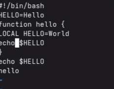
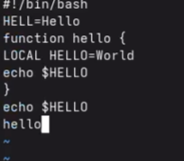

# Лабораторная работа № 10. Текстовой редактор vi

# Цель работы

Познакомиться с операционной системой Linux. Получить практические
навыки рабо- ты с редактором vi, установленным по умолчанию практически
во всех дистрибутивах.

# Задание

Задание 1. Создание нового файла с использованием vi 1. Создайте каталог
с именем \~/work/os/lab06. 2. Перейдите во вновь созданный каталог. 3.
Вызовите vi и создайте файл hello.sh 1 vi hello.sh 4. Нажмите клавишу i
и вводите следующий текст. 1 #!/bin/bash 2 HELL=Hello 3 function hello {
4 LOCAL HELLO=World 5 echo \$HELLO 6 } 7 echo \$HELLO 8 hello 5. Нажмите
клавишу Esc для перехода в командный режим после завершения ввода
текста. 6. Нажмите : для перехода в режим последней строки и внизу
вашего экрана появится приглашение в виде двоеточия. 7. Нажмите w
(записать) и q (выйти), а затем нажмите клавишу Enter для сохранения
вашего текста и завершения работы. 8. Сделайте файл исполняемым 1 chmod
+x hello.sh 74 Лабораторная работа № 8. Текстовой редактор vi 8.3.2.
Задание 2. Редактирование существующего файла 1. Вызовите vi на
редактирование файла 1 vi \~/work/os/lab06/hello.sh 2. Установите курсор
в конец слова HELL второй строки. 3. Перейдите в режим вставки и
замените на HELLO. Нажмите Esc для возврата в команд- ный режим. 4.
Установите курсор на четвертую строку и сотрите слово LOCAL. 5.
Перейдите в режим вставки и наберите следующий текст: local, нажмите Esc
для возврата в командный режим. 6. Установите курсор на последней строке
файла. Вставьте после неё строку, содержащую следующий текст: echo
\$HELLO. 7. Нажмите Esc для перехода в командный режим. 8. Удалите
последнюю строку. 9. Введите команду отмены изменений u для отмены
последней команды. 10. Введите символ : для перехода в режим последней
строки. Запишите произведённые изменения и выйдите из vi

# Теоретическое введение

8.2.1. Основные группы команд редактора 8.2.1.1. Команды управления
курсором Команды управления курсором приведены в табл. 8.1. Таблица 8.1
Команды управления курсором Курсор влево Курсор вправо Курсор вверх
Курсор вниз Space Enter (клавиша Backspace) (клавиша «пробел») h l k j
Кулябов Д. С. и др. Операционные системы 71 8.2.1.2. Команды
позиционирования – 0 (ноль) — переход в начало строки; – \$ — переход в
конец строки; – G — переход в конец файла; – 𝑛 G — переход на строку с
номером 𝑛. 8.2.1.3. Команды перемещения по файлу – Ctrl-d — перейти на
пол-экрана вперёд; – Ctrl-u — перейти на пол-экрана назад; – Ctrl-f —
перейти на страницу вперёд; – Ctrl-b — перейти на страницу назад.
8.2.1.4. Команды перемещения по словам1 – W или w — перейти на слово
вперёд; – 𝑛 W или 𝑛 w — перейти на 𝑛 слов вперёд; – b или B — перейти на
слово назад; – 𝑛 b или 𝑛 B — перейти на 𝑛 слов назад. 8.2.2. Команды
редактирования 8.2.2.1. Вставка текста – а — вставить текст после
курсора; – А — вставить текст в конец строки; – i — вставить текст перед
курсором; – 𝑛 i — вставить текст 𝑛 раз; – I — вставить текст в начало
строки. 8.2.2.2. Вставка строки – о — вставить строку под курсором; – О
— вставить строку над курсором. 8.2.2.3. Удаление текста – x — удалить
один символ в буфер; – d w — удалить одно слово в буфер; – d \$ —
удалить в буфер текст от курсора до конца строки; – d 0 — удалить в
буфер текст от начала строки до позиции курсора; – d d — удалить в буфер
одну строку; – 𝑛 d d — удалить в буфер 𝑛 строк. 1При использовании
прописных W и B под разделителями понимаются только пробел, табуляция и
возврат каретки. При использовании строчных w и b под разделителями
понимаются также любые знаки пунктуации. 72 Лабораторная работа № 8.
Текстовой редактор vi 8.2.2.4. Отмена и повтор произведённых изменений –
u — отменить последнее изменение; – . — повторить последнее изменение.
8.2.2.5. Копирование текста в буфер – Y — скопировать строку в буфер; –
𝑛 Y — скопировать 𝑛 строк в буфер; – y w — скопировать слово в буфер.
8.2.2.6. Вставка текста из буфера – p — вставить текст из буфера после
курсора; – P — вставить текст из буфера перед курсором. 8.2.2.7. Замена
текста – c w — заменить слово; – 𝑛 c w — заменить 𝑛 слов; – c \$ —
заменить текст от курсора до конца строки; – r — заменить слово; – R —
заменить текст. 8.2.2.8. Поиск текста – / текст — произвести поиск
вперёд по тексту указанной строки символов текст; – ? текст — произвести
поиск назад по тексту указанной строки символов текст. 8.2.3. Команды
редактирования в режиме командной строки 8.2.3.1. Копирование и
перемещение текста – : 𝑛,𝑚 d — удалить строки с 𝑛 по 𝑚; – : 𝑖,𝑗 m 𝑘 —
переместить строки с 𝑖 по 𝑗, начиная со строки 𝑘; – : 𝑖,𝑗 t 𝑘 —
копировать строки с 𝑖 по 𝑗 в строку 𝑘; – : 𝑖,𝑗 w имя-файла — записать
строки с 𝑖 по 𝑗 в файл с именем имя-файла. 8.2.3.2. Запись в файл и
выход из редактора – : w — записать изменённый текст в файл, не выходя
из vi; – : w имя-файла — записать изменённый текст в новый файл с именем
имя-файла; – : w ! имя-файла — записать изменённый текст в файл с именем
имя-файла; – : w q — записать изменения в файл и выйти из vi; – : q —
выйти из редактора vi; – : q ! — выйти из редактора без записи; Кулябов
Д. С. и др. Операционные системы 73 – : e ! — вернуться в командный
режим, отменив все изменения, произведённые со времени последней записи.
8.2.4. Опции Опции редактора vi позволяют настроить рабочую среду. Для
задания опций использу- ется команда set (в режиме последней строки): –
: set all — вывести полный список опций; – : set nu — вывести номера
строк; – : set list — вывести невидимые символы; – : set ic — не
учитывать при поиске, является ли символ прописным или строчным. Если вы
хотите отказаться от использования опции, то в команде set перед именем
опции надо поставить no. 8.3. Последовательность выполнения работы 1.
Ознакомиться с теоретическим материалом. 2. Ознакомиться с редактором
vi. 3. Выполнить упражнения, используя команды vi

# Выполнение лабораторной работы

Создаю каталог

Вызываем vi и создаем файл ssh.sh

Переходим в режим ввода текста

Делаем файл исполняемым

Открываем файл снова

.png)

Заменяем файлы

# Ответы на вопросы

Ответы на контрольные вопросы (лабораторная работа №8)

---

Вопрос 1. Дайте краткую характеристику режимам работы редактора vi.

Редактор vi имеет три режима работы. Командный режим предназначен для ввода команд редактирования и навигации по редактируемому файлу. Режим вставки предназначен для ввода содержания редактируемого файла. Режим последней строки (или командной строки) используется для записи изменений в файл и выхода из редактора.

---

Вопрос 2. Как выйти из редактора, не сохраняя произведённые изменения?

Чтобы выйти из редактора без сохранения изменений, необходимо находясь в командном режиме нажать клавишу Esc, затем нажать двоеточие, набрать символы q! и нажать Enter.

---

Вопрос 3. Назовите и дайте краткую характеристику командам позиционирования.

Команда 0 (ноль) осуществляет переход в начало строки. Команда $ осуществляет переход в конец строки. Команда G осуществляет переход в конец файла. Команда n G осуществляет переход на строку с номером n. Также существует команда gg для перехода в начало файла.

---

Вопрос 4. Что для редактора vi является словом?

Словом для редактора vi считается последовательность букв, цифр и символов подчёркивания, ограниченная пробелами, табуляцией, знаками пунктуации или началом и концом строки. При использовании прописных команд W и B под разделителями понимаются только пробел, табуляция и возврат каретки. При использовании строчных w и b под разделителями понимаются также любые знаки пунктуации.

---

Вопрос 5. Каким образом из любого места редактируемого файла перейти в начало (конец) файла?

Для перехода в начало файла из любого места необходимо нажать клавиши gg (дважды g) или ввести команду 1G. Для перехода в конец файла необходимо нажать клавишу G (большую букву).

---

Вопрос 6. Назовите и дайте краткую характеристику основным группам команд редактирования.

Основные группы команд редактирования включают: команды вставки текста (i - вставка перед курсором, a - вставка после курсора, I - вставка в начало строки, A - вставка в конец строки, o - вставка строки под курсором, O - вставка строки над курсором); команды удаления (x - удаление символа, dw - удаление слова, dd - удаление строки, d$ - удаление от курсора до конца строки); команды копирования и вставки (yy или Y - копирование строки, yw - копирование слова, p - вставка из буфера после курсора, P - вставка из буфера перед курсором); команды отмены и повтора (u - отмена последнего действия, . - повтор последнего действия); команды замены (cw - замена слова, r - замена одного символа, R - замена нескольких символов в режиме замены).

---

Вопрос 7. Необходимо заполнить строку символами $. Каковы ваши действия?

Необходимо в командном режиме установить курсор в начало строки с помощью команды 0, затем нажать клавишу R для перехода в режим замены, после чего нажать клавишу $ столько раз, сколько символов нужно заменить. Также можно использовать команду r$ для замены одного символа на знак доллара.

---

Вопрос 8. Как отменить некорректное действие, связанное с процессом редактирования?

Для отмены некорректного действия необходимо нажать клавишу u в командном режиме. Каждое нажатие u отменяет одно предыдущее действие. Для повтора последнего действия используется клавиша . (точка).

---

Вопрос 9. Назовите и дайте характеристику основным группам команд режима последней строки.

Команды записи и выхода: :w - сохранить файл, :w имя_файла - сохранить в новый файл, :q - выйти из редактора, :q! - выйти без сохранения, :wq - сохранить и выйти, :e! - отменить все изменения после последнего сохранения. Команды работы со строками: :n,m d - удалить строки с n по m, :n,m t k - скопировать строки с n по m в строку k, :n,m m k - переместить строки с n по m в строку k.

# Выводы

В ходе выполнения лабораторной работы я познакомилась с операционной системой Linux и получила практические навыки работы с текстовым редактором vi.

Я изучила три режима работы редактора: командный режим (для навигации и команд), режим вставки (для ввода текста) и режим последней строки (для сохранения и выхода). Научилась создавать новый файл командой vi hello.sh, вводить текст, сохранять изменения (:wq) и выходить без сохранения (:q!).

Выполнила основные команды редактирования: замену символов, удаление слов (dw), добавление строк (o), удаление строк (dd), отмену действий (u). Также научилась перемещаться по файлу с помощью команд G (конец файла) и 0, $ (начало и конец строки).

В результате был создан и отредактирован bash-скрипт hello.sh, который выводит на экран строки "Hello", "World" и "Hello". Работа с редактором vi освоена, все поставленные задачи выполнены.

# Список литературы

ТУИС. Архитектура компьютеров и операционные системы. Раздел
"Операционные системы". Лабораторная работа №10.

<https://esystem.rudn.ru/pluginfile.php/3097173/mod_resource/content/4/006-lab_proc.pdf>
