# Лабораторная работа № 10. Программирование в командном процессоре ОС UNIX. Командные файлы
Автор: Борисова Ксения Михайловна Преподаватель: Кулябов Дмитрий Сергеевич профессор \* профессор кафедры теории вероятностей и кибербезопасности \* Российский университет дружбы народов им. П. Лумумбы \* [kulyabov-ds\@rudn.ru](mailto:kulyabov-ds@rudn.ru) \* <https://yamadharma.github.io/ru/>

**Информация о докладчике**

{width="178"} Студент НБИбд-01-25

------------------------------------------------------------------------

# Цель работы

Изучить основы программирования в оболочке ОС UNIX/Linux. Научиться
писать небольшие командные файлы

------------------------------------------------------------------------

# Задание

 1.  Написать скрипт, который при запуске будет делать резервную копию
    самого себя (то есть файла, в котором содержится его исходный код) в
    другую директорию backup в вашем домашнем каталоге. При этом файл
    должен архивироваться одним из ар- хиваторов на выбор zip, bzip2 или
    tar. Способ использования команд архивации необходимо узнать, изучив
    справку.
2.  Написать пример командного файла, обрабатывающего любое произвольное
    число аргументов командной строки, в том числе превышающее десять.
    Например, скрипт может последовательно распечатывать значения всех
    переданных аргументов.
3.  Написать командный файл — аналог команды ls (без использования самой
    этой ко- манды и команды dir). Требуется, чтобы он выдавал
    информацию о нужном каталоге и выводил информацию о возможностях
    доступа к файлам этого каталога.
4.  Написать командный файл, который получает в качестве аргумента
    командной строки формат файла (.txt, .doc, .jpg, .pdf и т.д.) и
    вычисляет количество таких файлов в указанной директории. Путь к
    директории также передаётся в виде аргумента ко- мандной строки

 
------------------------------------------------------------------------

# Выполнение лабораторной работы

Создаю первый скрипт

---

Делаю скрипт исполняемым

---

Запускаю скрипт

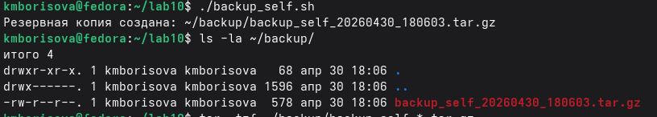

---

Просмотр содержимого архива

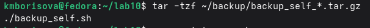

---

Создаю второй скрипт

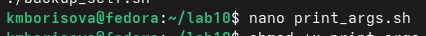

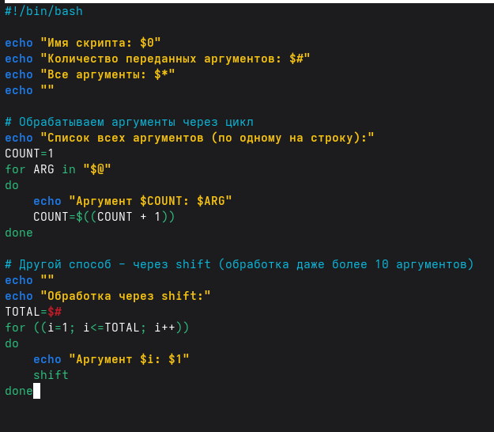

---

Делаю файл исполняем

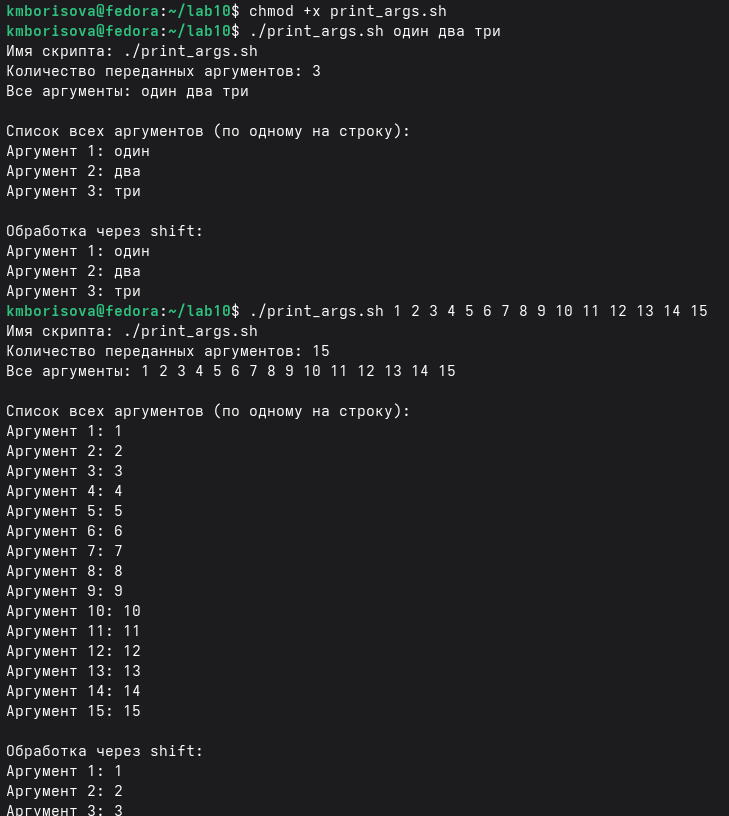

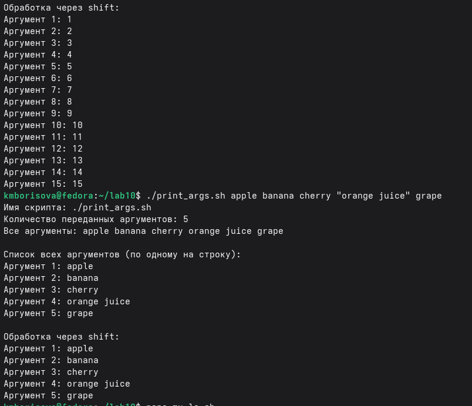

---

Cоздаю третий скрипт

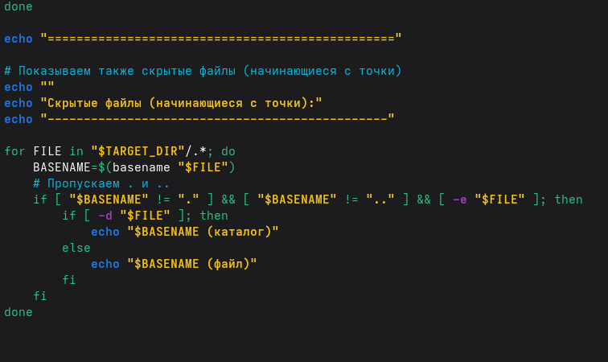

---

Делаю файл исполняемым

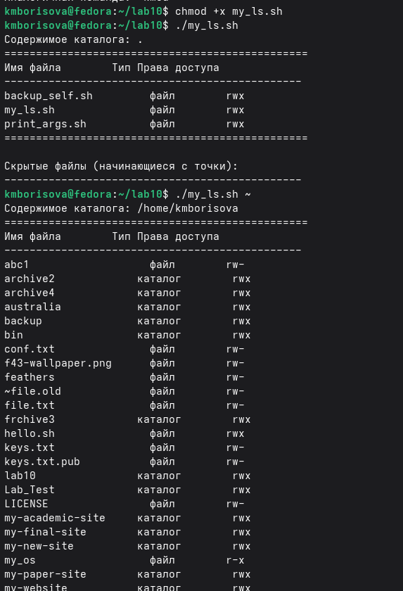

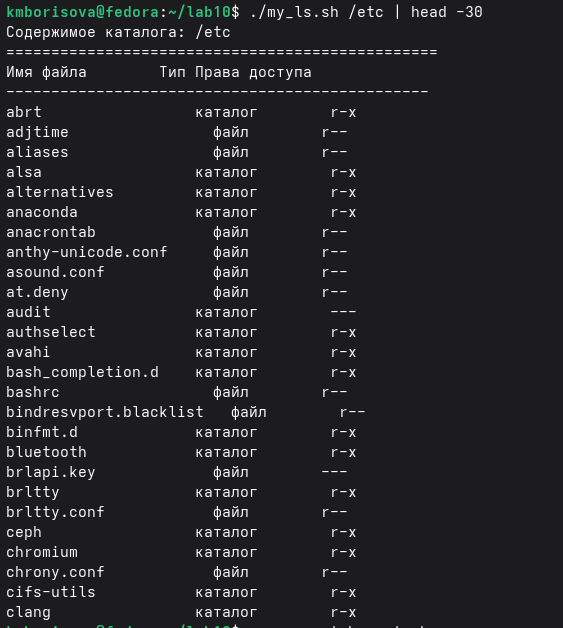

---

Делаю четвертый скрипт

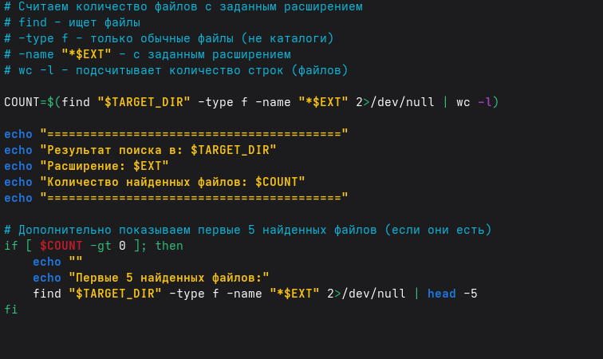

---

Делаю файл исполняемым

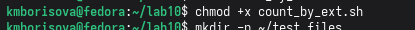

---

Создаю тестовые файлы для проверки

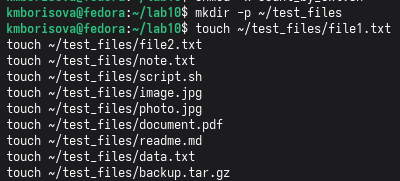

---

Тестирую скрипт

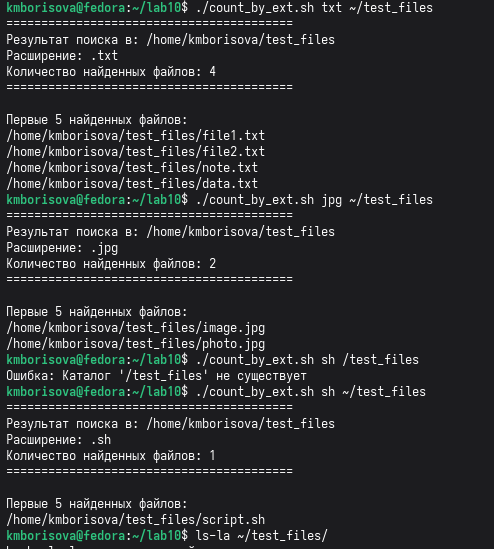

---

# Ответы на вопросы

Командная оболочка - программа для взаимодействия пользователя с ОС. Примеры: sh, bash, csh, zsh. Отличаются синтаксисом и дополнительными функциями.

POSIX - стандарт, обеспечивающий совместимость между разными UNIX-подобными системами.

Переменные: name=value, использовать как $name. Массивы: arr=(a b c), обращение ${arr[0]}.

let - выполняет арифметические операции. read - читает ввод пользователя в переменные.

Сложение (+), вычитание (-), умножение (*), деление (/), остаток (%), сравнения и логические операции.

(( )) - двойные скобки для арифметических вычислений и условных проверок.

HOME, PATH, USER, SHELL, PWD, PS1, PS2 и другие.

Метасимволы - специальные символы: * ? [ ] { } $ | & ; ( ) < > \ " '

Экранирование: обратный слеш \*, одинарные кавычки '*', двойные кавычки "$*"

Создать файл с #!/bin/bash, сделать исполняемым chmod +x, запустить ./файл

Функции: function имя { команды; } или имя() { команды; }

Проверка: if [ -d "имя" ] - каталог, [ -f "имя" ] - обычный файл

set - установка параметров/массивов, typeset - объявление переменных/функций, unset - удаление

Через $1, $2, ..., $9, ${10}. $@ - все аргументы, $# - количество.

$0 - имя скрипта, $1-$9 - аргументы, $# - количество, $@ - все аргументы, $? - код возврата, $$ - PID процесса.

---

# Выводы

В ходе работы я научился создавать bash-скрипты, использовать переменные, циклы, условные операторы, обрабатывать аргументы командной строки, работать с файловой системой.

---

# Список литературы

ТУИС 
